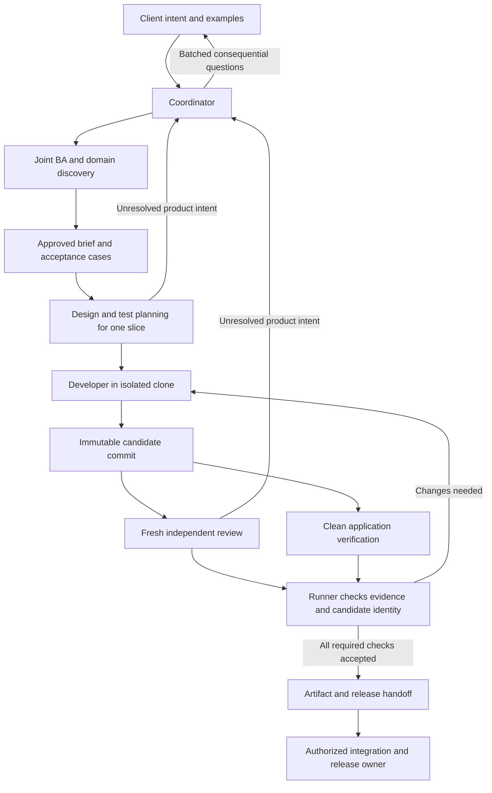
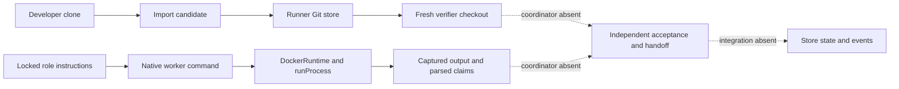

# Agent factory: finalized build specification

Revision 5.3, 2026-09-23. Status: implementation specification updated after primary-source research. Runtime acceptance and product evaluations remain to be built and passed.

This document supersedes revisions 1-5.2. Sections 1-12 are the operative specification. Section 13 records history, sources, and the rationale for revision 5. Previous versions remain beside this file as `agent-factory-design-history-r1-r3.md`, `agent-factory-design-history-r4.md`, `agent-factory-design-history-r5.md`, `agent-factory-design-history-r5-1.md`, and `agent-factory-design-history-r5-2.md`. Historical records and upstream skill text are excluded from worker context.

## 1. Purpose and delivery boundary

Build a small software-development factory that turns a client's intent into a reviewed, reproducibly verified software candidate. Optimize for correct business behavior, ease of use, reliability, and maintainability. Agent count, document count, test count, and speed are not proxies for those outcomes.

Version 1 supports Git-based web applications, services, and command-line software that can build and run in Linux containers. It uses a local command-line interface and an existing interactive Pi session as coordinator. It does not need a dashboard, message broker, daemon, distributed scheduler, or database.

The factory produces:

- A client-approved brief with examples, exclusions, and measurable acceptance conditions.
- Small implementation slices and immutable candidate commits.
- Independent code review and application verification tied to the exact candidate.
- A verified build or package with a recorded rebuild procedure, operating instructions, and a release handoff with named ownership.
- A decision and evidence record that another agent or engineer can resume.

The default delivery mode is `handoff`. A named release owner receives the artifact and its deployment and recovery requirements. The factory reports `handoff_ready`, not `released`. Production deployment is performed by the project's established release system under separate authorization. An optional release receipt records its outcome; it does not allow workers to deploy.

Native desktop/mobile execution, distributed workers, continuous autonomous production operation, and multiple competing orchestration backends are outside version 1. Unsupported projects fail preflight with an explicit capability gap. Do not silently downgrade verification.

## 2. Final architecture decisions

| Decision | Final choice |
|---|---|
| Agent runtime | Direct one-shot Pi CLI child processes, supervised by a small local TypeScript runner. |
| Envoy and other delegation plugins | Excluded from version 1. Do not fork Envoy or combine it with a pstack port. |
| Coordination | One interactive coordinator; durable file-based run state owned by the runner. |
| Worker communication | Structured handoffs through the coordinator. No peer bus or recursive spawning. |
| Isolation | Independent worker clones inside disposable containers, not shared Git worktrees. |
| Skills | A curated, versioned local adaptation of selected MP, PS, and TLC guidance. No whole-plugin install or automatic pstack routing. |
| TDD | Developer alone loads `factory-tdd`. Developer and Tester consult the same declarative testing-quality reference; it contains no implementation workflow. |
| Commits and review | Developer creates a local candidate commit first. Independent review and verification examine that commit. |
| Integration | No automatic merge-back. The release owner uses the existing protected integration path after required checks. |
| Client decisions | Client owns outcomes, business policy, and consequential unresolved intent. Technical execution within the approved brief is delegated. |
| Default concurrency | One active run per state root, one writable implementation worker, and at most two supervised worker or check jobs within that root. A second worker may perform independent read-only analysis or review. |
| First delivery | A complete vertical slice with acceptance, failure, cleanup, and resume evidence. |
| Improvement policy | Compare representative product tasks before adding specialists or changing models, skills, or prompts. Required independent verification remains in every configuration. |

The runner enforces explicit child configuration, persistent candidate handoff, command-result capture, resource limits, recovery, and rejection of stale or failed acceptance. Keep it limited to those functions. The coordinator supplies planning judgment; do not implement another planning engine.

## 3. Responsibilities and authority

Keep six named roles. They are responsibilities, not six permanent processes. The coordinator may perform routine BA and architecture work. It must delegate independent verification of implementation work.

| Role | Owns | Must deliver | Cannot do |
|---|---|---|---|
| Business Analyst | Client intent, workflow, scope, examples | Approved brief, acceptance cases, unresolved questions with owners | Invent product policy or approve on behalf of the client |
| Domain Architect | Business terms, rules, invariants | A concise glossary and relevant business scenarios | Assume DDD patterns or multiple bounded contexts are required |
| Technical Architect | Interfaces, data changes, failure handling | A slice-level design and test strategy proportional to risk | Freeze a design against contrary implementation evidence |
| Developer | Implementation and local tests | Candidate commit, base commit, local evidence, deviations | Change acceptance policy, integrate remotely, or deploy |
| Tester | Independent review and verification | Findings and acceptance evidence for the exact candidate | Accept its own implementation fix or weaken checks to obtain a pass |
| Observer / Coordinator | Scheduling, task state, scope, escalation | Accepted handoffs and a complete decision record | Override failed mandatory checks, forge client approval, or treat worker claims as proof |

The integration and release owner is a named operator or external team. This is an authorization role, not a seventh autonomous worker. It controls protected integration and production credentials.

The Communicator is a writing discipline applied by the coordinator. Use the local `factory-communicate` skill for client prose and authored handoffs. Its prose rules follow unslop; its handoff rules specify clear fields, references, and completion criteria. Never rewrite structured results, commands, requirement IDs, logs, quoted errors, or stored evidence. Store a readable summary alongside the original evidence.



## 4. Client agreement and task intake

Start by reading supplied documents and inspecting the existing product. Treat supplied documents, repository content, and worker output as evidence to evaluate, not automatic authorization to expand scope or perform external actions.

Create one brief with these fields:

| Field | Required content |
|---|---|
| Objective | The user problem and observable successful outcome |
| Users and journeys | Who performs the task and the real steps they take |
| Examples | Representative inputs and expected results, including important exceptions |
| Rules | Business invariants, permissions, prohibited outcomes |
| Constraints | Supported devices, interfaces, integrations, data sensitivity, expected load |
| Scope | Included work and explicit exclusions |
| Acceptance | Stable IDs with observable pass conditions and evidence methods |
| Delegation | Decisions the factory may make without further client input |
| Open questions | Impact, recommended answer, owner, and affected tasks |
| Delivery | Named recipient, handoff requirements, and production authorization boundary |

The client normally approves the objective, workflows, consequential rules, and acceptance examples together. Existing explicit instructions can supply this approval. Do not request it again merely because a new task or agent starts.

The factory may choose internal structure, test placement, routine dependencies, and reversible implementation details within the approved constraints. Escalate unknown pricing, permission policy, retention requirements, changed user priorities, material vendor commitments, and scope changes. A technical architect confirms testing interfaces; the client need not understand testing terminology.

Ask only questions that affect the result. Batch related questions, show a recommendation, and explain the consequence in ordinary language. Continue unrelated work while waiting. Silence does not approve an assumption.

For uncertain interactions, create a throwaway prototype before substantial implementation. Have the client or a representative user complete a realistic task. Record confusion, errors, and recovery. Visual approval alone does not establish usability. For established workflows, accepted examples and existing design references can avoid another prototype.

For UI work, the brief or project profile records approved visual references, design conventions, supported viewports, and observable user-task criteria. The Technical Architect owns the implementation design; BA confirms that the journey matches client intent. No additional permanent design agent is required.

All assumptions must be marked `confirmed`, `provisional`, or `rejected`. A provisional assumption cannot pass an acceptance condition that depends on it. Assign a spec revision and content digest after approval; revisions preserve the previous version.

## 5. Delivery loop and state transitions

Break work into complete vertical slices. Each slice should produce observable behavior and fit one worker's context. A small bug need not pass through separate architecture agents. For a bug, first reproduce the end-user failure in the closest practical environment; then narrow it for diagnosis and regression testing.

For each slice:

1. Coordinator selects approved requirements and the current base commit.
2. Architects and Tester identify relevant invariants, interfaces, failure modes, and checks. Security analysis occurs here when exposure, identity, permissions, or sensitive data changes.
3. Developer implements with `factory-tdd`, runs local checks, and records deviations.
4. Developer commits all intended source changes to its isolated branch. Runner imports and records the candidate; uncommitted intended changes block submission.
5. A fresh Tester context reviews the candidate against both the brief and coding standards. It receives the approved brief, diff, source, and raw evidence, not the Developer's conclusions as facts.
6. Runner executes required checks on a clean copy of that candidate in the verification environment. Tester adds independent application scenarios where necessary.
7. Findings return to a new Developer attempt. Every change creates a new candidate and invalidates prior acceptance.
8. When checks and review pass, runner creates a verified handoff. The release owner integrates using established repository protections and reruns required checks against the integrated result.

Use one authoritative task state:

| State | Entry condition | Permitted next states |
|---|---|---|
| `draft` | Brief or task incomplete | `ready`, `awaiting_input`, `cancelled` |
| `ready` | Approved scope and dependencies available | `running`, `awaiting_input`, `cancelled` |
| `running` | Runner has started a bounded role attempt | `candidate`, `changes_requested`, `awaiting_input`, `failed`, `cancelled` |
| `candidate` | Candidate imported and identity recorded | `verifying`, `changes_requested`, `awaiting_input`, `cancelled` |
| `verifying` | Independent review or checks underway | `verified`, `changes_requested`, `awaiting_input`, `failed`, `cancelled` |
| `changes_requested` | Reproducible findings or an incomplete submission | `ready`, `awaiting_input`, `failed`, `cancelled` |
| `awaiting_input` | Named decision is required | Recorded prior state after resolution, or `cancelled` |
| `verified` | Evidence accepted for the current candidate and spec | `handoff_ready`, `changes_requested`, `awaiting_input`, `cancelled` |
| `handoff_ready` | Artifact, evidence, instructions, recipient complete | `released` after a separate release receipt, `changes_requested`, `awaiting_input`, `cancelled` |
| `released` | Authorized release result recorded | Terminal for this task; new changes become a new task |
| `failed` / `cancelled` | Terminal attempt or task outcome | New explicit attempt may be created; history remains |

Discovery and design attempts can run while a task is `draft` or `ready`; they produce proposed documents and do not move it to `running`. That transition starts implementation. Record each attempt's process status separately from the task's acceptance state. A run's progress is derived from its task states. Do not maintain a second competing status authority.

When the brief changes, increment its revision, identify affected tasks, and invalidate their acceptance. Preserve unaffected evidence as history. For version 1, rerun the full required check set on every new candidate, including all previously accepted requirements that remain in scope. Final handoff verifies the complete agreed product against one final candidate and artifact. Earlier task passes remain historical evidence and cannot substitute for final-product verification. Optimize test selection only after a demonstrated need.

## 6. Skill definitions and loading

Workers load only the local factory skills defined below. MP, PS, and TLC are development-time sources recorded in provenance. Their original skill bodies, routers, workflow instructions, and historical review records are excluded from runtime bundles. Write each local skill as a complete instruction set with one resolved behavior for every decision. Retain applicable licenses and attribution separately from executable instructions.

### 6.1 Role skills

| Local skill | Assigned responsibility | Operative instructions |
|---|---|---|
| `factory-discovery` | BA or Domain Architect | Read the approved brief and relevant source evidence. BA proposes user journeys, requirements, and acceptance examples. Domain Architect proposes business vocabulary, rules, and scenarios. Write proposed artifacts to scratch. Send unresolved consequential decisions to Coordinator; use existing delegated authority for routine technical choices. |
| `factory-design` | Technical Architect | Design one slice within the approved scope. Define interfaces, relevant failure handling, UI conventions, and test strategy. When section 6.3.1 triggers apply, inspect existing architecture and propose scoped improvements. Confirm testing interfaces under the brief. Write proposed design and authorized prototypes to scratch. Return specialist requests to Coordinator. |
| `factory-tdd` | Developer only | For bugs, reproduce the end-user failure first. Implement one behavior at a time using failing tests and independent expected values. Run local checks. Developer owns implementation, refactoring, and repairs after review. Submit a clean candidate commit with evidence and deviations. |
| `factory-review` | Tester reviewing | Inspect the exact base and candidate against the approved brief, cumulative acceptance, and calibrated rubric. Report correctness and standards findings with evidence. A missing specification blocks completion. Keep the candidate read-only and return repair findings to Coordinator. |
| `factory-verify` | Tester authoring checks | Propose behavioral checks in the separate check directory. Inspect runner-captured results and identify coverage gaps. Report application startup or functional defects to Coordinator for Developer repair. Runner executes accepted checks; candidate source remains read-only. |
| `factory-coordinate` | Coordinator | Select bounded tasks, reconstruct context, record authorized decisions, and request runner operations. Track cumulative acceptance, budgets, and recovery. Dispatch required independent verification and route repairs to Developer. Return consequential unresolved product decisions to the client. |
| `factory-communicate` | Coordinator | Write plain, complete sentences following unslop. Use exact domain terms. Write handoffs with explicit facts, hypotheses, evidence references, and completion criteria. Preserve structured records, commands, quotations, and raw evidence unchanged. |

These instructions replace conflicting upstream workflows completely. Runtime skills contain the adopted behavior only, with no competing instruction and no precedence override intended to reconcile it.

### 6.2 Invocation bundles

Each invocation receives the skills for its current responsibility. Switching between Tester review and check authoring starts a fresh context. When Coordinator performs discovery or design, it uses a separate bounded invocation of the relevant bundle and returns proposed artifacts to coordination.

| Invocation | Loaded skills | Writable scope |
|---|---|---|
| Business Analyst | `factory-discovery`, with BA task contract | Proposed brief and acceptance examples |
| Domain Architect | `factory-discovery`, with domain task contract | Proposed glossary and business scenarios |
| Technical Architect | `factory-design` | Proposed design and authorized prototype scratch |
| Developer | `factory-tdd` | Candidate clone and local tests |
| Tester reviewing | `factory-review` | Structured report captured from stdout |
| Tester authoring checks | `factory-verify` | Proposed checks and scratch |
| Coordinator | `factory-coordinate`, `factory-communicate` | Authorized task, decision, and summary operations through runner |

A shared local `testing-quality.md` reference defines behavior-based assertions, independent expected values, appropriate mocks, and cumulative coverage. Developer and Tester may read it. Tests observe public behavior and persisted external effects required by acceptance. The reference contains testing criteria only; implementation workflow belongs exclusively to `factory-tdd`.

### 6.3 Local references

Bundle local declarative references only when needed for the assigned task: domain analysis for complex business rules, coupling analysis for interface design, security threat analysis for exposed or sensitive behavior, and guidance for the actual project stack. References contain analytical criteria and domain facts. Tool authority, write permissions, delegation, and approval behavior come from the role contract and the local skills above.

Business terms follow the approved glossary. Use precise technical terms such as HTTP API, UI component, deployed service, and security trust boundary. Preserve explanatory comments about constraints and non-obvious behavior. Build task-specific tools when repeatability, scale, or safer execution justifies them.

Write an ADR when a decision has meaningful reversal cost, needs explanation to a future maintainer, and involved a real trade-off, or when the user requests one. Routine decisions stay in the task record. Accessibility references use current primary W3C guidance and the agreed project target. [W3C contrast guidance](https://www.w3.org/WAI/WCAG22/Understanding/contrast-minimum.html).

### 6.3.1 Architecture improvement when relevant

The Technical Architect uses a local `factory-design/references/architecture-improvement.md` reference adapted from the analytical methods in `improve-codebase-architecture`. Load it when the task requests architecture review or refactoring, a feature requires coordinated changes across tightly coupled modules, a reproduced bug exposes unclear ownership or difficult testing, or repeated changes reveal the same structural problem. Record the trigger and relevant evidence in the task. An isolated change without these signals uses the normal slice design process.

Scope the review to the requested area and its relevant dependencies. Read the domain glossary and applicable ADRs. Use change history to identify frequently changed code when the task does not already identify the problem area. Assess whether understanding one behavior requires tracing many modules, whether interfaces expose nearly as much complexity as their implementations, whether responsibilities are unclear, and whether public behavior is difficult to test. Consider consolidating shallow modules when it would hide complexity behind a simpler interface. Distinguish evidence of a problem from a stylistic preference; module count alone is not a defect.

For each justified proposal, record affected files, observed friction, the proposed responsibility and interface changes, expected effect on testing and future changes, migration risks, and verification requirements. Compare the proposal with leaving the structure unchanged. Add a before-and-after diagram when it clarifies the change. Identify any ADR that would need reconsideration. Write the proposal to scratch and return it to Coordinator.

Coordinator prioritizes the proposal within existing scope and delegated authority. Consequential product changes or added scope follow the existing client decision process. Developer implements accepted changes, and Tester independently verifies the resulting candidate against cumulative acceptance. Architecture analysis does not itself authorize implementation or changes to accepted domain documents.

The reference contains analysis criteria only. Its provenance records the upstream source; runtime loading uses the local reference. The role's existing tool, communication, and write permissions apply.

### 6.4 Bundle acceptance

Each local skill has a unique name and explicit local dependencies. All references resolve within the selected read-only bundle. Worker specialist requests return to Coordinator. Project instructions come from the approved context bundle. Candidate mounts and tool permissions enforce the assigned writable scope.

Review every skill and transitive reference for contradictions in authority, writes, tool use, completion criteria, and prose rules. A conflicting instruction is deleted from the proposed bundle before approval. Record provenance and editorial decisions outside worker context. Installation checks validate unique names, resolved paths, approved resources, and hashes. Behavioral evaluations verify that Tester reports a startup defect without repairing the application, Developer implements a repair, and workers return specialist requests to Coordinator. Structural checks alone cannot establish semantic compatibility.

Each adaptation has provenance in `skills.lock.json`: local name, source repository and commit, source paths, licenses, dependency paths, editorial notes, and content hashes. The runtime bundle contains approved skill text, required local references, and applicable license notices. Original source workflows and editorial history remain in maintainer records. Promote model, prompt, skill, and tool changes through section 12 evaluations, retaining the prior version for rollback. Freeze the bundle for the duration of a run.

## 7. Execution mechanism and isolation

### 7.1 Runtime

Implement one local TypeScript CLI using Node.js 22.19 or newer. Use a pinned Pi package and a package lock. The official source inspected on 2026-09-22 declares Pi `0.87.0`; treat this as the initial compatibility target, not proof of an installed or published package. During bootstrap, verify package availability and all required flags, then freeze the exact tested version and container image digest. An unavailable target or incompatible flag is a build blocker, not permission to switch backends silently. [Pi package source](https://raw.githubusercontent.com/earendil-works/pi/main/packages/coding-agent/package.json).

Use Pi's one-shot JSON mode. Generate process arguments as an array, never by interpolating prompts into a shell command. The runner owns timeout, cancellation, stdout/stderr capture, and exit-status recording.

The invocation must use explicit model/provider values, disable automatic resources, and load only selected local skills. The following is the intended CLI shape; the implementation must verify it against the pinned binary:

```text
pi --mode json --print --no-session
   --no-extensions --no-skills --no-prompt-templates --no-themes
   --no-context-files --no-approve
   --provider <configured-provider> --model <exact-model-id>
   --tools <role-tool-list>
   --skill <approved-local-skill-path>
   --append-system-prompt <approved-role-and-policy-file>
   -- @<task-contract-file>
```

Repeat `--skill` for the selected files. Pi documents that explicit skill paths remain available with automatic skill discovery disabled. Resource flags do not carry to children automatically, so construct every child invocation explicitly. [Pi CLI reference](https://raw.githubusercontent.com/earendil-works/pi/main/packages/coding-agent/docs/cli.md).

A dedicated ephemeral Pi configuration directory contains only the selected provider setup. Do not mount the user's home, normal Pi settings, plugins, SSH agent, Git credential store, or cloud configuration. Resolve trusted project instructions during intake and include them explicitly in the policy file. Disabling automatic discovery must not discard the user's actual project rules.

Use these tool selections:

| Attempt | Pi tools | Writable output |
|---|---|---|
| BA, Domain Architect, Technical Architect | `read,grep,find,ls,write,edit` | Proposed documents and prototype files in scratch |
| Developer | `read,grep,find,ls,write,edit,bash` | Its source clone and scratch |
| Tester in review mode | `read,grep,find,ls` | Final structured report captured from stdout |
| Tester authoring additional checks | `read,grep,find,ls,write,edit,bash` | Separate proposed-check and scratch directories; candidate source remains read-only |

A prototype or architecture experiment that needs execution uses a runner-managed sandbox with the same project capabilities as verification. It does not give a design agent host shell access. Execution of mandatory checks is a runner operation, not a Pi role.

Configure model IDs at project setup from the user's available providers. Default worker roles to one capable selected coding model; permit a separate review model when available. Record actual model IDs and settings in evidence. Never infer that different personas establish independent knowledge, and never silently fall back to a cheaper or different model after an authentication or capability error.

### 7.2 Filesystem and credentials

Use disposable containers without privileged mode or a Docker socket mount. Each worker gets an independent clone with its own Git metadata. No hardlinked object stores, shared writable `.git` directory, or credential-bearing remotes are exposed.

| Location inside worker | Access |
|---|---|
| Candidate/source clone | Developer may write its clone. Reviewers read the candidate snapshot. |
| Approved task, spec, policies, skill bundle | Read-only |
| Worker proposal/output directory | Writable; contents remain worker claims until validated |
| Scratch/build directories | Writable and isolated per attempt |
| Runner state, accepted evidence, release credentials | Not mounted |

Some tests need writable source trees or generated files. Run them in a fresh disposable copy and compare the tracked source before and after. Writes to approved build output directories are allowed; modifications to candidate source invalidate the check. Test planning must identify generated output directories.

Allow only the configured provider credential and project-approved test credentials into agent containers. Dependency installation and application execution occur inside isolated environments. Verification containers normally need no model-provider credentials. Production credentials are never available to workers or application tests. A Developer with shell access may read the model-provider credential available to its container; a container does not separate that credential from code running inside it. Use scoped credentials and provider-side spending limits when available. If the project requires stronger credential separation, use an existing supported mechanism and prove its boundary before unattended execution.

Network access is an explicit project capability. Agent containers need outbound provider access; dependency preparation needs package-source access. The default application-verification network contains only its disposable app and test services, with no external access. Permit named external test integrations only when the project authorizes them. Ordinary Docker networking does not enforce a domain allowlist for agent egress; record that limitation rather than claiming otherwise. If the project requires stricter egress, use existing environment controls and block unattended work until they are in place. Do not build a custom proxy. Container isolation does not prove resistance to every malicious dependency or host exploit; the trusted runner and host remain part of the security boundary.

Measure dependency installation and startup time before optimizing them. If they materially limit throughput, reuse immutable prepared images or package caches keyed by dependency lock, toolchain, and platform. Keep writable source and build outputs isolated. Prefer real local services or existing emulators over custom service replicas; validate any necessary replica against the real integration behavior relevant to acceptance.

### 7.3 Candidate lifecycle

Runner snapshots a clean source commit at intake. If the user's checkout has uncommitted work, require an explicit decision about its inclusion and create a separate snapshot; never reset or overwrite that checkout.

Developer creates commits only in its isolated clone. On submission, runner validates the repository state, base ancestry, intended diff, and allowed paths, then imports the candidate into runner-owned Git storage using local transport with hooks and external diff tools disabled. Imported code remains untrusted data until reviewed. Runner never runs project scripts on the host.

A handoff contains immutable base and candidate commit IDs. Tester clones from the runner's candidate store and checks out that exact candidate. A branch name or sibling ID is insufficient. Version 1 processes dependent implementation slices sequentially, so each new task has an unambiguous base.

No worker exit, text verdict, or upstream `verified` label changes acceptance state. No worker performs merge-back. The user checkout stays unchanged throughout the run.

## 8. Artifacts, evidence, and persistence

Use ordinary files and runner-owned Git storage. Keep run data outside both the user checkout and disposable worker volumes. The operator chooses the state root at setup; workers cannot write it.

```text
<state-root>/<run-id>/
  state.json
  events.jsonl
  brief/<revision>.md
  tasks/<task-id>/contract.json
  candidates.git/
  attempts/<attempt-id>/
    invocation.json
    stdout.jsonl
    stderr.log
    result.json
    handoff.json
    usage.json
    proposed/
  evidence/<candidate-id>/<check-id>/<execution-id>/
    result.json
    stdout.log
    stderr.log
    artifacts/
  reviews/<candidate-id>/<review-id>.json
  decisions/<decision-id>.json
  handoff/
```

Candidate source is content-addressed by Git. Other accepted artifacts have SHA-256 hashes. `state.json` is the transition authority. `events.jsonl` records transitions for inspection. Use a maintained process-safe locking library and atomic file replacement on the supported local filesystem.

A state-root execution lock permits only one runner process to dispatch or supervise jobs at a time. Keep the lock while owned jobs run. A resumed process reconciles surviving owned containers and processes before dispatching replacements; acquiring a released lock alone does not prove that children stopped. Record an active run ID under this lock. A different run cannot start until that run completes or the operator explicitly suspends or cancels it after stopping its jobs. Suspension releases the active-run reservation without changing task acceptance states. Different state roots have independent limits; version 1 does not claim a machine-wide concurrency limit. Per-run mutation locks protect state operations, using a fixed root-then-run lock order when both are needed. Read-only status does not dispatch work. Cancel and suspend requests use the per-run lock to persist a control request without waiting for the execution lock. The supervising runner observes the request, stops owned jobs, records the outcome, and releases its reservation and execution lock. If it has died, recovery acquires the execution lock and reconciles owned jobs first. Never wait for another lock while holding the per-run lock.

For each transition, reconcile the existing event log first. Under the run lock, write and durably replace `state.json` with the next transition ID and the full corresponding event payload. Then append and durably flush that event to `events.jsonl`. Do not commit another transition until the log contains the current state's event. On recovery, repair an incomplete trailing record or append a missing final event from state; a matching ID must have matching content. A log ahead of state, a conflicting event, or corruption before the trailing record blocks automatic recovery. Test crash recovery on the supported filesystem, including file and directory flush behavior.

This commit order governs local records, not exactly-once external effects. Record intent and an action ID before launching a process or external action, then record its observed outcome. If the runner dies between launch and outcome capture, reconcile by that identity before retrying. Never infer success or repeat an uncertain action from an event ID alone.

Required handoff fields:

| Record | Fields |
|---|---|
| Task contract | Schema version, run/task/attempt IDs, logical attempt ID, role, objective, spec digest, base commit, allowed paths, cumulative acceptance IDs, selected skills and hashes, required checks, timeout, capabilities, budget limits and verification reserve |
| Attempt handoff | Base and candidate or partial-work snapshot identity, remaining acceptance IDs, relevant files and symbols, attempted fixes and outcomes, facts and hypotheses, reproduction commands, evidence references, next bounded action |
| Usage | Run/task/attempt IDs, model and settings, reported input/cached-input/output tokens, elapsed time, compute use, pricing snapshot, actual or estimated cost, unknown usage, remaining budget, stop reason |
| Candidate | Base commit, candidate commit, changed paths, clean-submission result, imported object location, declared deviations |
| Check result | Execution ID, candidate commit, spec digest, check definition digest, runtime/image identity, dependency lock digest, sanitized environment identity, argv/cwd, start/end, exit code or signal, evidence paths/hashes |
| Review | Candidate/spec IDs, requirements checked, correctness findings, standards findings, severity, evidence references, unresolved questions |
| Decision | Question, owner, input evidence, chosen answer, rationale, authority source, affected task/spec IDs |
| Release handoff | Candidate and integrated revision if available, artifact digest, accepted evidence references, operating and recovery instructions, known limitations, recipient |

Version 1 accepts an empty or incomplete worker report only as an incomplete attempt. Reject unknown schema versions and malformed records. File references must resolve within their allowed roots; reject traversal and symlink escapes before importing evidence.

Commands come from reviewed project check definitions, not worker-provided arbitrary shell strings. Store executable and argument arrays, working directory, timeout, and permitted environment variable names. Where a shell is necessary, reference a reviewed script with a digest.

Runner captures process results directly. Worker-authored JSON cannot claim to be a runner check result. Keep failed output, screenshots, and logs for diagnosis. Every check execution and review has an immutable record; reruns never overwrite earlier evidence. Redact secrets at capture without changing the meaning of evidence; if redaction prevents assessment, mark the limitation. Human-readable summaries link to the source evidence.

Initial worker context contains the approved brief, relevant project policy, selected role skills, current task, and compact validated attempt handoff. Retrieve source and detailed evidence when needed. Keep raw logs available without inserting their full history into each prompt. Runner validates referenced identities and paths; worker-authored explanations remain claims until checked.

Retain candidate commits, accepted records, and evidence for at least 30 days by default. Worker volumes may be removed only after candidate import and evidence export succeed. Preserve incomplete work after failure or cancellation until the operator chooses recovery or disposal. Cleanup never removes records for an active, awaiting-input, or failed handoff. Provide explicit cleanup; no background retention service is needed.

## 9. Verification and release gates

Acceptance requires all of the following for the same candidate and spec:

1. All required checks for the current slice and previously accepted in-scope behavior actually ran and passed. Missing, skipped, timed-out, or cancelled checks do not count as passes. Final handoff covers the complete approved product on one final candidate.
2. Independent review has no unresolved blocking finding and no missing acceptance coverage.
3. Candidate source, check definitions, dependencies, and relevant configuration match their recorded identities.
4. Required product decisions are resolved by the named authority.
5. The artifact and evidence still exist and their hashes match.

The coordinator may classify findings and order rework. It cannot convert a failed mandatory check into a pass. A requirement or check change requires a recorded reason, appropriate approval, a new digest, and fresh verification. Record a lower-severity accepted limitation explicitly; never reclassify a functional failure as style to bypass the gate.

Use these check categories where relevant:

- Build, static types, lint, and the maintained test suite.
- Business examples and invariant tests with independent expected values.
- Real application journeys through the UI, API, or CLI the user actually uses.
- Negative authorization and tenant-isolation cases for protected data.
- Concurrency, retries, duplicate delivery, timeouts, and partial failures for affected behavior.
- Responsive layout, keyboard and focus behavior, validation, loading/empty/error states, and recovery for user interfaces.
- Performance under the brief's representative workload and defined targets.
- Migration compatibility and backup restoration when stateful changes require them.

Mocks may isolate external services at real integration boundaries. They cannot replace every interaction with the system whose behavior is being accepted. A screenshot, successful compilation, or high coverage percentage alone is insufficient.

The Tester authors extra checks in a separate proposal area. Coordinator accepts the check definition before runner execution and freezes its digest. The Developer cannot alter those accepted checks. Repository test changes remain reviewable code changes. Review checks for tautological expected values, weakened assertions, disabled cases, inappropriate mocks, and hidden success paths.

Protect selected evaluator-authored scenarios from Developer access as well as modification. Keep them outside its clone and context, and derive them only from approved requirements. The Developer receives the business rules and representative examples; held-out tests must not introduce hidden product requirements. Failure feedback names the violated requirement and gives useful reproduction evidence. Record exposed cases as development feedback and retain separate, unexposed cases when evaluating later factory changes. Keep ordinary project regression tests available to developers. Use independent expected values and generated cases or metamorphic properties where they fit the domain.

Before promoting a reviewer configuration, calibrate it on known-correct candidates and seeded defects with independently fixed expected outcomes. Include wrong business rules, cross-feature regressions, weakened assertions, display-only controls, and permission failures where applicable. Record missed defects and false alarms. Use human assessment to calibrate subjective judgments against client-approved references. A visual score cannot compensate for functional failure. Fresh context and different personas do not establish reviewer accuracy.

The project verification profile names the actual browser, API, or CLI driver, service readiness checks, fixture data, test identities, and teardown. Interactive verification records actions and resulting state, including relevant persisted effects, rather than screenshots alone. The runner executes approved driver scripts and retains transcripts, screenshots, and structured assertions. Tester proposes new driver steps as reviewed checks; it does not gain arbitrary access to runner state or an unrestricted execution service.

Keep the first failed test result. Permit bounded diagnostic reruns under the same budget, but a later pass cannot erase the failure. Resolve an application defect with a new candidate. For an infrastructure failure, record the diagnosis and environment change before a fresh complete verification. Unexplained flakiness remains blocking; changing a mandatory check follows the existing approval and digest rules.

If Tester discovers a code fix, return it to Developer. If Tester itself produces the fix, that attempt becomes implementation work and a fresh independent verifier is required.

For releases, the existing CI or release system must verify the integrated revision, not only the pre-merge candidate. Configure protected branches without worker bypass privileges and protect mandatory workflow definitions. Workers must not have rule-editing or release rights. [GitHub branch protection](https://docs.github.com/en/repositories/configuring-branches-and-merges-in-your-repository/managing-protected-branches/about-protected-branches).

Produce build artifacts from a clean candidate after successful verification. Record the artifact digest and execute relevant smoke checks against that artifact, so a tested source tree is not confused with an untested package. If integration or release rebuilds it, record and check the replacement artifact. A recorded environment and rebuild procedure establish traceability, not byte-for-byte reproducibility. Claim byte-for-byte reproducibility only after independent clean builds produce matching digests under a declared treatment of variable metadata.

The handoff names rollout-stop signals, the owner of failures, and the recovery method. Distinguish code rollback from data restoration. An application rollback does not reverse destructive migrations. State explicitly when production checks have not been performed. A release receipt includes the deployed artifact, environment, integrated revision, external evidence source, observation result, and the authorized owner's acknowledgment. Preserve whether evidence was machine-checked or reported by that owner.

## 10. Failure handling and conflict resolution

Default limits per task are one implementation attempt plus two rework attempts and 30 minutes per logical worker attempt. A state root admits at most two supervised worker or check jobs, with only one writable implementation worker. Application services and subprocesses belong to their owning job and count toward its container limits; they are not independent agent slots. The operator may set project limits before a run. A timeout cannot be evaded by silently starting another run. The runner exposes no nested delegation operation. Worker instructions prohibit launching another agent manually; ordinary shell access is not proof that arbitrary subprocess creation is impossible. Apply container CPU, memory, process-count, and lifetime limits to the entire attempt, including subprocesses.

Before dispatch, setup records a finite run-wide token or spending budget and a verification reserve. Include discovery, design, implementation, review, retries, and checks. Record provider usage when available; distinguish reported values from estimates and unknown values. Cost estimates use a dated pricing snapshot. Missing usage is not zero. If usage cannot be measured or bounded well enough to enforce the selected policy, block further dispatch and report the limitation. Reserve estimated request and verification capacity before starting work. State the maximum possible overshoot when usage arrives after completion; a strict spending cap requires provider enforcement or conservative upper bounds supported by the runtime.

A planned context continuation stays within the same logical attempt, remaining wall-clock allowance, rework count, and run budget. Preserve partial work and its handoff before starting the fresh process. Record a continuation in process status while preserving the task state. Implementation remains `running`, review remains `verifying`, and discovery retains its current state. A continuation is not a new successful candidate or an acceptance transition. Provider backoff and retries consume the same allowance. Do not extend limits or reset counters by starting another context or run. Exhausted budgets or repeated failures without new evidence enter `awaiting_input` with the last state, evidence, and a proposed next action; no acceptance gate is waived. Existing authorization for a configured continuation does not require another approval.

Use this resolution sequence:

1. Check the brief and source evidence.
2. Reproduce the disputed behavior or perform one bounded experiment.
3. If needed, ask one independent challenger for the strongest supported objection.
4. Coordinator decides technical matters within delegated authority or escalates product matters to the client.

Juries and multi-model races are excluded from version 1. They can be added later only with measured benefit and explicit authorization. Lack of evidence should produce an experiment, a limitation, or a question, not a vote presented as fact.

After the rework limit, enter `awaiting_input` with the failed checks, attempted fixes, and a concrete recommendation. Human approval is not required for routine reversible fixes within the agreed task, but additional scope or a changed business rule is a new decision.

On cancellation, terminate the attempt's container/process group, stop its test services, retain partial work and logs, and record its last confirmed state. Do not kill processes by name.

On resume, inspect existing candidate and evidence records before starting work. Start a fresh Pi context with a reconstructed contract and the validated attempt handoff from section 8. Include failed approaches and their outcomes so the worker can avoid repeating them. If the worker crashed before writing a handoff, reconstruct it from preserved source and runner-captured evidence, marking unknowns. Do not depend on a vanished in-memory conversation. Resume from the last confirmed transition. Before retrying an external action, inspect its outcome using the external system's identifier or idempotency key. If its outcome cannot be determined, ask the action owner rather than repeat it.

Successful completion, planned context continuation, resource exhaustion, infrastructure failures, authentication failures, missing capabilities, application defects, and unresolved client decisions must have different reason codes. A provider outage does not become an application regression, and an unavailable browser test does not become a pass.

## 11. Implementation plan and acceptance tests

### 11.1 Build artifacts

Implement the runner, role contracts, and adapted skills in one repository. Use a straightforward layout:

```text
src/                 CLI, process execution, state, candidate and evidence handling
roles/               Role instructions and explicit skill selections
skills/              Curated local adaptations and necessary references
skills.lock.json     Upstream pins, adaptation notes, hashes and licenses
schemas/             Project, task, decision, review and check-result schemas
fixtures/            Small sample app and intentionally broken changes
tests/               Unit checks and end-to-end factory acceptance tests
evals/               Versioned product tasks, reviewer calibration, and results
docs/                 Setup, operation, supported scope and recovery
```

Do not add empty layers or a generic plugin system. Use existing Docker, Git, Pi, package-manager, browser-test, and CI tools. Keep product-specific behavior in a project profile rather than hardcoding one app.

Provide these CLI operations, with machine-readable results and concise human summaries:

| Operation | Behavior |
|---|---|
| `factory init` | Validate project profile, runtime, models, container support, source snapshot, policies and recipient |
| `factory start` | Create a run from a brief and recorded approval or existing authorization |
| `factory step` | Execute an allowed next role attempt or required verification step; reject invalid transitions |
| `factory status` | Show task state, active-run reservation, owned jobs, budget, candidate, evidence gaps and pending questions |
| `factory suspend` | Stop owned jobs, preserve partial work and acceptance state, then release the active-run reservation |
| `factory decision` | Record a technical decision or a genuine client/operator response with its authority source |
| `factory cancel` | Stop owned processes and retain recoverable work |
| `factory resume` | Reconcile state and reconstruct the next attempt without duplicating effects |
| `factory handoff` | Export the accepted artifact and evidence, or explain exactly which gate blocks it |
| `factory cleanup` | Remove eligible scratch resources without destroying retained records |

The coordinator uses these operations; workers do not receive the runner executable or its state root. Client approvals are accepted only through the trusted coordinator/operator interaction, never from child output. The coordinator is trusted to represent the client's actual instruction faithfully; this design does not claim to authenticate a human from arbitrary text.

Project setup must supply repository and base, approved policies, model/provider IDs, runtime image, build/test/check definitions, test fixtures and credentials, driver and readiness commands, finite run-wide budget and verification reserve, resource limits, capabilities, delivery recipient, and relevant visual/performance/accessibility/recovery targets. These are project inputs, not unresolved architecture choices. Report missing inputs together with recommendations.

### 11.2 Build order

1. Bootstrap the pinned runtime and container execution. Prove a single explicit-skill Pi worker can read its contract, edit a fixture, and return a local candidate.
2. Implement candidate import, persistent raw evidence, failure cleanup, and clean verifier checkout. Prove failed or missing checks block handoff before adding more roles.
3. Add the local skill adaptations and explicit role dispatch. Test for collisions, unresolved calls, and accidental plugin discovery.
4. Add the brief, authority record, cumulative acceptance, state-root execution limits, crash-consistent transitions, budgets, bounded rework, and handoff-based resume.
5. Deliver one real vertical slice with calibrated independent review, a clean build, application verification, and a release handoff.
6. Run the acceptance matrix, document setup and recovery, and complete a representative product-evaluation pilot. Report its scope and failures before calling the factory operational.
7. Evaluate changes to prompts, skills, models, or optional specialists one at a time. Keep required independent verification and release gates unchanged.

A stub provider is appropriate for repeatable process/state tests. At least one live configured provider run is required to establish that the actual Pi invocation and skill bundle work. Report stub, live-provider, and product-runtime evidence separately.

### 11.3 Required factory acceptance matrix

| Test | Required observable result |
|---|---|
| Approved happy-path slice | Correct behavior, imported candidate, independent review, all required evidence, complete handoff |
| Worker says pass but required test fails | Handoff blocked; no integration action |
| Worker exits successfully without required checks | Verification remains incomplete |
| Staged or unstaged implementation edits | Submission blocked until intended changes are committed; review cannot omit them |
| Candidate changes after passing checks | Prior acceptance invalidated |
| Brief or check definition changes | Affected verification invalidated |
| Sibling or fresh verifier starts | Exact submitted candidate is checked out, not the original base |
| Worker forgets to commit or crashes | Partial source and logs remain recoverable |
| Cleanup after success and failure | Required artifacts and evidence survive; active resources remain untouched |
| Duplicate resume or concurrent runner call | No duplicate transition or external effect; run lock enforced |
| Cancelled or timed-out check | Recorded as non-pass; owned processes are stopped |
| Missing provider or unsupported capability | Explicit setup failure; no silent fallback or downgraded acceptance |
| Duplicate skill name or unapproved resource | Setup fails; unexpected skill/plugin does not load |
| Bundle includes contradictory workflow or transitive instructions | Bundle approval fails until the instructions are adapted or separated into distinct invocations |
| Architecture review requested or structural friction evidenced | Technical Architect loads the local reference, returns a scoped evidence-backed proposal, and preserves candidate source |
| Isolated change without an architecture-review trigger | Workflow completes without a mandatory codebase-wide review |
| Tester encounters broken application startup | It reports the defect and preserves the candidate; Developer receives the repair task |
| Hostile instruction in document or worker result | No acceptance-policy change or unauthorized action |
| Worker tries to alter runner state or use release credentials | Access unavailable; attempt cannot grant itself authority |
| Developer weakens an existing regression check | Independent review flags it; unchanged mandatory external checks still run |
| UI fixture with keyboard/error-state defect | Application verification detects the affected journey |
| Migration fixture with recovery failure | Handoff reports the blocking recovery gap |
| Client changes a consequential rule | Decision and spec revised; affected work returns for verification |
| Handoff without production execution | Status remains `handoff_ready`, never `released` |
| Later slice breaks an earlier accepted journey | New candidate and final handoff fail cumulative acceptance |
| Two simultaneous runs under one state root | Only the reserved run dispatches jobs; the job limit holds |
| Runner dies while children survive | Resume reconciles or stops owned children before replacement dispatch |
| Cancel or suspend during a long-running job | Control request reaches the supervisor without waiting for the execution lock; owned jobs stop and state survives |
| Crash before state replacement or during event append | Recovery exposes one committed transition and repairs only a missing or partial trailing event |
| Conflicting state and event content | Automatic recovery blocks instead of guessing |
| Fresh context after a failed approach | Correct candidate or partial-work snapshot and failure history recovered; prior failure is not blindly repeated |
| Continuation, provider retry, or review exhausts budget | Allowances do not reset; unverified work cannot pass |
| Known-good and seeded-defect reviewer cases | Expected decisions checked; misses and false alarms recorded and blocking misses resolved |
| Implementation hardcodes development examples | Independent scenario detects the violation without changing requirements |
| Exposed evaluation case reused after tuning | Disclosure recorded; case cannot be reported as unexposed evidence |
| Failed check passes a diagnostic rerun | First failure retained; unexplained flakiness still blocks |
| Factory configuration improves demo but breaks a regression task | Promotion blocked; prior configuration remains available |

Use fault injection against the runner's state and process boundaries. Do not write tests that merely reproduce its own implementation decisions. Tests must demonstrate the failure modes this design is intended to prevent.

## 12. Completion and evaluation

### 12.1 Operational acceptance

The first operational milestone requires the section 11.3 matrix, a live-provider vertical slice, reviewer calibration, and successful setup and recovery by another agent from a clean checkout. No unresolved blocking failure may be hidden behind a demo. Record the tested project scope and limitations. This milestone establishes a working execution path, not broad production reliability.

### 12.2 Product evaluation

Keep product-development evaluations separate from runner fault-injection fixtures. Use versioned tasks drawn from intended projects, covering a new user journey, an end-user bug, an existing-code change, and data or authorization changes when supported. Freeze starting commits, briefs, evaluation definitions, environments, model settings, and budget policy before comparing configurations. Separate prompt-tuning examples from unexposed evaluation cases. Record any case disclosed through repair feedback.

Begin with a small repeated pilot. Ten representative tasks with three independent trials per configuration is a planning example, not a required spending commitment or statistical guarantee. The operator selects the pilot size within the authorized evaluation budget. Report sample size, variation, exclusions, infrastructure failures, and unsuccessful trials. A single vertical slice is not a representative evaluation.

The baseline uses coordinator-led discovery and design, one Developer, and the required independent verification. Compare one change at a time, such as an optional architect process, extra review, task size, handoff format, or model assignment. Compare quality under equal budgets and resources required to reach the same acceptance threshold. Do not weaken acceptance to make a configuration appear faster. Multi-writer experiments remain outside version 1 unless separately authorized.

Record the following for each trial and configuration:

| Measure | Definition |
|---|---|
| Accepted-task rate | Accepted tasks divided by attempted tasks, using the same frozen criteria |
| Delivery time | Elapsed time through verification, including startup, waiting, rework, and integration when in scope |
| Cost per accepted task | Total model and execution cost, including failed trials, divided by accepted tasks; undefined when none pass |
| Human effort | Minutes spent clarifying, intervening, evaluating, and repairing |
| Quality after acceptance | Escaped defects, cumulative regressions, and user-task failures during the stated observation period |
| Verification quality | Seeded defects missed, false alarms, flaky checks, and missing coverage |
| Recovery | Time and correctness when resuming interrupted work |

Unknown usage or unobserved post-release outcomes remain unknown. Report current acceptance separately from later observed reliability. Tokens, commits, code volume, and review scores do not replace accepted user outcomes.

### 12.3 Promotion and learning

After an escaped defect or recurring correction, add the smallest representative case to the application or factory regression set. Change the responsible check, tool, instruction, or skill. Keep one-off project details out of universal skills. Evaluate the proposed change against both its target failure and existing regression tasks before promotion, preserving pins and rollback information. Tune on development cases and confirm on separate evaluation cases. Do not repeatedly tune against the same nominal holdout while calling it independent.

A new blocking regression prevents promotion. Fix it or retain the prior configuration; do not silently change a case or its acceptance threshold to manufacture a pass. Requirement changes need the existing decision process and a new evaluation version. For other trade-offs, record the measured quality, resource use, and decision. Prefer accepted quality and maintainability over a lower token price alone.

Re-evaluate workflow stages after model changes. Remove optional stages when repeated evidence shows they add no useful quality or reliability. Additional specialists, concurrency, juries, or runtimes require measured benefit and any authorization required by scope. Required independent verification remains part of this design until explicitly revised.

The design is a testable implementation hypothesis. Claim operational scope and comparative efficiency only to the extent established by the recorded evaluations.

## 13. Conflict history and source record

### 13.1 Final resolution of the reviews

| Conflict or finding | History | Final resolution |
|---|---|---|
| Inventory scope versus client outcome | Early pushback called acceptance and release concerns out of scope; revision 3 accepted a compact contract | Acceptance and named release ownership are mandatory; detailed project procedures stay outside the central design |
| Six roles versus simpler runtime | Original diagrams implied a serial station pipeline | Keep six responsibilities; coordinator dispatches bounded workers as needed |
| Observer cannot produce work | Original observer was a passive referee | Coordinator may perform routine discovery and design; independent verification remains separate |
| Developer commit prohibition | Contradicted MP `implement` | Local candidate commits allowed; no worker integration or deployment authority |
| Review before commit | MP implementation sequence could omit current edits from committed-diff review | Commit first, review the exact candidate, reverify every replacement candidate |
| MP invocation blockers | Early audits counted three or four; table actually assigned eleven flagged MP skills | Maintain explicit local adaptations under approved delegation, with recorded provenance |
| Two TDD skills | Originally presented as intentional per-role duplication; Pi resolves names by load order | One local MP-derived `factory-tdd`; no name collision |
| Removing two PS skills | Default router could invoke them transitively | No pstack router or whole-plugin installation; transitive calls removed |
| Envoy completion trust | Self-reports and unsigned messages were confused with independent evidence | Runner-captured checks and fresh review determine acceptance |
| Envoy merge behavior | Source trace showed `unverified` could reach merge-back despite the description saying success | Envoy excluded; worker completion never initiates integration |
| Envoy role skill selection | Profiles lacked per-role skill loading | Every direct Pi invocation receives an explicit isolated bundle |
| Worktree cleanup and sibling state | Cleanup could discard evidence; siblings did not automatically receive the candidate | Independent clones, runner-owned candidate storage, explicit verifier checkout, retention before cleanup |
| Peer bus | Source supported addressing, but live inter-child flow was not independently established | No bus needed in version 1; structured handoffs through coordinator |
| Communicator on all messages | Prose rewriting could alter evidence | Prose-only discipline; raw evidence retained unchanged |
| Human escalation only for irreversible work | Could settle unknown business rules without client input | Escalate consequential unresolved intent; execute delegated technical decisions autonomously |
| Vocabulary ban | First review overstated the original scope | MP terms apply to module design; precise domain, UI, API and security terms remain allowed |
| ADR contradiction | TLC already excluded trivial decisions | One significance gate and one concise format; no claimed blanket contradiction |
| Missing skills and directory names | Inventory mostly held; declared names sometimes differed | Local names are unique and checked; source paths remain in provenance |
| Catalog safety claims | Accessibility table had a standards error | Verify consequential guidance against primary sources; correct adopted content |
| Source inspection versus runtime proof | Earlier labels implied more verification than had occurred | Preserve the evidence levels below; acceptance requires execution |
| Build complexity | Both reviews warned against replacing a routing document with a platform | One narrow local runner is justified by concrete execution gaps; no broker, service, generic backend layer, or dashboard |

### 13.2 Evidence levels

- `SOURCE`: inspected in repository text or code.
- `TRACED`: control flow followed in source, without full runtime execution.
- `LOCAL-REPRO`: reproduced locally with a described experiment.
- `UPSTREAM-REPORTED`: the project reports a test; this review did not reproduce it.
- `DESIGN`: a decision in this specification.
- `UNTESTED`: an integration requiring the acceptance matrix.

The Envoy failed-verification merge path is `TRACED`. The staged/unstaged three-dot review omission is `LOCAL-REPRO` in a disposable Git repository. The new direct-Pi factory composition is `DESIGN` and `UNTESTED` until built. A signature establishes message origin, not functional correctness.

### 13.3 Inspected sources

| Source | Pinned revision | Use |
|---|---|---|
| [MP](https://github.com/mattpocock/skills/tree/c55ee46073ed923f86ce59a5eb3b6d895095d1b7) | `c55ee46073ed923f86ce59a5eb3b6d895095d1b7` | Discovery, domain language, testing, review and handoff guidance |
| [PS](https://github.com/michael-denyer/pstack-claude/tree/2fe2002190bff9257d3e27f84ba6818f2cfd7e32) | `2fe2002190bff9257d3e27f84ba6818f2cfd7e32` | Evidence, diagnosis, verification and writing guidance |
| [TLC](https://github.com/tech-leads-club/agent-skills/tree/120b67676388241b314699fa8fa9af25ada6d1d4) | `120b67676388241b314699fa8fa9af25ada6d1d4` | Conditional architecture, security and quality references |
| [Original pstack](https://github.com/cursor/plugins/tree/53e579f1481697931fc44f5445171397cfa2b24b/pstack) | `53e579f1481697931fc44f5445171397cfa2b24b` | Port comparison; not installed separately |
| [Envoy](https://github.com/jmnargi/pi-envoy/tree/f7a35ed2d2ceafae21fd9f9a711ed97d5ad61579) | `f7a35ed2d2ceafae21fd9f9a711ed97d5ad61579` | Historical runtime findings; excluded from build |
| [pi-delegate](https://github.com/hLxiao9/pi-delegate/tree/441b73725975c7818f00ce06b56e6d43f7fa56bd) | `441b73725975c7818f00ce06b56e6d43f7fa56bd` | Historical restricted-worker comparison; excluded from build |
| [Registry](https://github.com/truefoundry/awesome-skills-registry/tree/388ba54e01e09da1ae3789e160a3a24e034b4f61) | `388ba54e01e09da1ae3789e160a3a24e034b4f61` | Discovery only; never the installed source of truth |

The earlier inventory check found 38 MP skills, 54 PS skills including 23 principles, and 14 TLC architecture skills. It reproduced 13 stale MP directory names among 29 registry entries. These counts explain the history and do not determine the final loadout.

PS records upstream pstack pin `e8d856f`. The reviewed current-source comparison found 46 shared skill directories with port differences. That count is not evidence that every skill is semantically outdated. Review the selected instructions and preserve each adaptation's provenance.

Bootstrap must retrieve exact skill commits and verify hashes. A shallow clone of today's default branch is not a reproduction of these findings. Preserve applicable per-skill licenses and attribution; TLC includes third-party material with its own metadata. Do not treat catalog-wide marketing claims as a technical guarantee.


### 13.4 Revision 5 research and adopted changes

Revision 5 incorporates the 2026-09-22 research review. These are design changes awaiting execution, not measured improvements to this factory.

| Evidence | Adopted change | Limit |
|---|---|---|
| [Anthropic, application development, 2026-03-24](https://www.anthropic.com/engineering/harness-design-long-running-apps) | Calibrate evaluators and test whether optional stages remain useful after model changes | First-party examples vary in scope, compute, and model; they do not isolate architecture as the cause |
| [Anthropic, agent evaluations, 2026-01-09](https://www.anthropic.com/engineering/demystifying-evals-for-ai-agents) | Separate capability evaluations, regression tasks, and runner acceptance fixtures | Guidance for designing evaluations, not proof of factory quality |
| [Anthropic, context engineering, 2025-09-29](https://www.anthropic.com/engineering/effective-context-engineering-for-ai-agents) | Use compact restart handoffs and retrieve detailed evidence when needed | Context policy requires validation with the configured model |
| [StrongDM factory principles](https://factory.strongdm.ai/principles) | Add independent scenario coverage and explicit disclosure records | The disclosure protocol is this design's choice; service replicas are conditional |
| [Cursor, January 2026](https://cursor.com/blog/scaling-agents) and [July 2026](https://cursor.com/blog/agent-swarm-model-economics) | Keep concurrency and merge coordination proportional to demonstrated need | Their evolving large-scale experiments do not justify a custom version-control system here |
| [Scaling agent systems, version 3, 2026-04-08](https://arxiv.org/abs/2512.08296v3) | Compare coordination choices on the intended task distribution | Benchmark findings do not establish the best architecture for production software delivery |

The specification review also identified cumulative acceptance ambiguity, a mismatch between per-run locking and claimed global concurrency, and unspecified recovery between state and event writes. Sections 5, 8, 9, and 10 now define these behaviors. These were deductions from revision 4, not reproduced implementation defects.

The revision adds run-wide resource accounting, calibrated review, concrete driver and UI profiles, and evaluated promotion of factory changes. It preserves the direct Pi runtime, six responsibilities, one writable worker, isolated clones, explicit skills, and separate release owner. Revision 4 remains the exact historical record of prior decisions.


### 13.5 Revision 5.1 skill compatibility correction

The source-level audit found an unresolved role conflict in assigning the implementation-oriented TDD workflow to Tester. Tester now receives either review or check-authoring instructions in a fresh context, and shares only declarative test-quality guidance with Developer. The audit also identified upstream verification repair instructions, discovery approval and spawning rules, review delegation rules, and writing shorthand guidance that require explicit removal during adaptation. These corrections specify compatible bundles; the adapted skill files still require creation, full transitive review, and behavioral evaluation before a conflict-free implementation can be claimed.


### 13.6 Revision 5.2 instruction cleanup

Section 6 now states only the adopted role behavior. Original workflow bodies and conflict-resolution commentary remain outside worker context. Developer alone receives implementation instructions; Tester receives either review or check-authoring instructions; Coordinator receives one compatible coordination and communication bundle. Upstream references are research provenance, not runtime instructions. The local skill files and their runtime evaluations remain implementation work.


### 13.7 Revision 5.3 architecture improvement capability

Restored the architecture-analysis methods from [MP improve-codebase-architecture](https://github.com/mattpocock/skills/blob/c55ee46073ed923f86ce59a5eb3b6d895095d1b7/skills/engineering/improve-codebase-architecture/SKILL.md) as a conditional local reference for `factory-design`. Section 6.3.1 defines its triggers, bounded scope, evidence, and handoff. Coordinator owns prioritization, Developer owns implementation, and Tester owns independent verification. The local reference remains an implementation deliverable under the existing skill adaptation and validation requirements.

## 14. Architecture and implementation review, 2026-09-23

### 14.1 Verdict and scope

[SOURCE] Reviewed commit `83351370f40583c641d3ed45da0d928d14d7372a`, initially clean, using `architect`, `agent-factory-review`, their tracing and design-comparison methods, the repository verification skill, and unslop. This section adds a review; sections 1-13 remain unchanged. The subscription ADR supersedes Pi and model defaults. This review does not reverse that decision or authorize implementation, provider spending, integration, or release.

[DESIGN] Keep the local, file-based, single-writer architecture. Repair the candidate and evidence boundaries before building the coordinator. The review identified four P1 defects in those boundaries and one P2 direct-process lifetime defect. None requires a daemon, database, broker, extra permanent agent role, or new orchestration framework.

[SOURCE] The intended delivery is a verified candidate and artifact handed to a named release owner, for Git-based software runnable in Linux containers. The current delivery is seven library modules and local tests. The README already states that the CLI, acceptance coordinator, prepared image, and live-provider validation are absent. Six responsibilities do not require six processes. Routine design can remain with the coordinator, with independent review required for implementation.

[LOCAL-REPRO] Node `v24.19.0` passed typechecking and all 23 existing tests. All seven role bundles loaded with digest `9feaaf5bdb3783991ce1d5ecd44ca1ddfba4d3d630dab072e764eb77ff3f4fce`. These results establish only the checked library behaviors. The reproduced failures below cover paths omitted by that suite.

### 14.2 Traced model and rationale constraints

[TRACED] `Store` owns state-root execution reservation, per-run mutation locks, atomic state replacement, and event reconciliation. State is authoritative; recovery repairs a missing final event and rejects conflicting history. `contracts.ts` checks serialized shape and some consistency rules. Neither module establishes acceptance, and no production coordinator calls the library to bind checks, review, and artifacts into an accepted outcome.

[TRACED] `git.ts` checks source cleanliness, creates an independent bare store, validates submissions in the developer repository, and fetches a candidate into `refs/candidates/<sha>`. `checkout` then attempts a normal clone and detached checkout. `bundle.ts` hashes selected instructions; `workers.ts` constructs native invocations and interprets completion events. `DockerRuntime.execute` builds container arguments and invokes `runProcess`, which captures output and supervises timeouts. Worker completion remains a claim.

[TRACED] The diagram shows existing library relationships and the absent operational connection. It is not evidence of a completed factory journey.



[SOURCE] Git history contains one initial commit; blame supplies no earlier implementation rationale. The design and ADR explicitly justify subscription-native workers, isolated clones, independent verification, and file-based state. Preserve those constraints. No issue, team-chat, infrastructure-observability, error-tracking, or analytics connector was available for this review. Local documents were inspected; external organizational documents were not searched. Implementation-time reasons for the defects remain unknown.

### 14.3 Prioritized defects and repair acceptance

#### F1. P1: submission validation can execute worker-configured code on the host

[TRACED] `src/git.ts:39` runs `git status` inside the worker-owned repository through the helper at line 8. Disabling hooks, fsmonitor, and global configuration does not disable repository-local content filters. The developer can modify its Git configuration, while attributes select the filter. Submission validation therefore crosses the boundary in section 7.3 before it accepts or rejects a candidate.

[LOCAL-REPRO] In a disposable repository, a harmless configured clean filter wrote a marker during `importCandidate` and the import then rejected the dirty worktree. The retained marker `/tmp/factory-repro-filter-prfbgf/HOST_FILTER_EXECUTED` contains `host-execution`. Rejection after the side effect does not protect the host. This was a local Git/library experiment, not a container escape experiment.

[DESIGN] Status relative to specification: **contradictory implementation**, sections 7.2-7.3 already prohibit running untrusted project behavior on the host. Do not run host Git against worker-controlled repository configuration. Perform operations requiring that configuration inside the existing isolated runtime, transfer objects as untrusted data, and validate them in runner-owned storage. Prove worktree cleanliness independently of worker-authored claims. A few additional `-c` overrides are not a complete configuration boundary.

[DESIGN] Acceptance: submission with a harmless executable filter must leave the host marker absent, whether import succeeds or rejects. A normal clean submission must still work. Include dirty tracked and untracked files, executable filters, and local configuration indirection. Keep this test at the public submission boundary.

#### F2. P1: imported candidates are unavailable to fresh verifier clones

[TRACED] `src/git.ts:56` publishes only `refs/candidates/<sha>`, but `checkout` at lines 31-33 uses a normal transport clone, which fetches branches and tags. A new candidate reachable only through the custom ref is absent from the verifier repository.

[LOCAL-REPRO] The public sequence `createStore`, developer commit, `importCandidate`, then `checkout` imported candidate `a070969e0ff491595cb1a720688aa0508a6a52c1` successfully and failed checkout with `fatal: unable to read tree`. The main reviewer repeated the checkout independently. Evidence is `/tmp/my-aifactory-review-20260923/checkout.log`; the original fixture is `/tmp/factory-repro-checkout-mXl2LF`.

[DESIGN] Status relative to specification: **contradictory implementation**, section 7.3 and section 11.3's fresh-verifier case already require the exact submitted candidate. Fetch that exact retained ref or object into a fresh verifier before removing transport configuration, detach at its identity, and verify HEAD. Do not depend on the store's default branch containing the candidate.

[DESIGN] Acceptance: commit a change after creating the store, import it, materialize a new verifier, and assert both the exact HEAD and changed file contents. Repeat with two sequential candidates. The existing Git test reads the object directly from bare storage and misses this final step.

#### F3. P1: candidate validation and import can inspect different trees

[TRACED] The Git helper does not disable replacement objects. `importCandidate` validates ancestry, changed paths, and tree modes in the worker repository at `src/git.ts:44-55`, then fetches the original commit into runner storage at line 56. Worker-local replacement refs can change the tree seen during validation without changing the submitted commit ID.

[LOCAL-REPRO] A disposable submission returned changed paths `['allowed']` and candidate `5367136e64cc3abc9a818ae4541e74724bffb7ef`. Reading the imported candidate's `protected` file from runner storage returned `UNAUTHORIZED`. The fixture remains at `/tmp/factory-repro-replace-C2c2tS`. This demonstrates an implemented allowed-path bypass; it does not depend on the future coordinator.

[DESIGN] Status relative to specification: **contradictory implementation**, sections 7.3 and 9 already bind scope validation to the exact candidate. Disable replacement-object interpretation and validate original commit ancestry, changed paths, and tree modes in runner-owned quarantine before publishing the candidate ref. Treat the worker's changed-file list as a claim. The [Git documentation](https://git-scm.com/docs/git#Documentation/git.txt---no-replace-objects) identifies the replacement-disable control, but that control alone does not fix F1.

[DESIGN] Acceptance: replacement metadata must not make a disallowed original tree pass. Assert rejection, no published candidate receipt, and unchanged permitted-path behavior for ordinary submissions and unusual filenames. Validate the imported tree, not merely equality of commit strings.

#### F4. P1: workers can alter runner-captured logs

[TRACED] `DockerRuntime.execute` writes stdout and stderr to `job.outputDir` at `src/runtime.ts:68`. `dockerCommand` mounts that same directory writable at `/output`, using the host UID/GID, at `src/process.ts:224-236`. Mode `0600` does not separate the worker from these files. A worker can alter captured bytes or write around the process output limit.

[LOCAL-REPRO] An actual `runProcess` child wrote `FORGED EVIDENCE` directly into the configured stdout file without emitting stdout; the call reported completion. The retained file is `/tmp/factory-log-tamper-XgwQwX/stdout.log`. This proves same-user file tampering. [UNTESTED] The container mount exposure is source-traced; no live Docker run or accepted-handoff exploit was demonstrated.

[DESIGN] Status relative to specification: **contradictory implementation**, sections 7.2 and 8 already separate worker proposals from runner-owned evidence. Give execution distinct proposal and capture directories. Mount only proposals and scratch; keep capture, invocation records, usage records, and results outside every worker-writable mount. Derive those paths under runner ownership so callers cannot accidentally alias them.

[DESIGN] Acceptance: a real container can write its proposal but cannot read, replace, truncate, or symlink the runner capture files. The runner must retain exactly the emitted, redacted bytes and enforce the configured byte limit. A command-construction test is useful but cannot replace this live boundary check.

#### F5. P2: normal process completion abandons descendants

[TRACED] At `src/process.ts:156-174`, child close resolves supervision. Group termination runs only if a stop reason already exists; normal completion and ordinary nonzero exit assign their reason afterward and clear the timeout. Descendants that close inherited pipes can outlive the call.

[LOCAL-REPRO] A child spawned an unreferenced same-group descendant with ignored stdio and exited successfully. `runProcess` reported completion with a 500 ms allowance; the descendant was still alive 700 ms later and the experiment explicitly terminated it. [UNTESTED] This is a direct-process-library defect, not evidence of a surviving Docker workload or a container escape.

[DESIGN] Status relative to specification: **partial implementation**, sections 7.1 and 10 require bounded attempt lifetime, including subprocesses. Reconcile and stop owned descendants on all terminal paths before declaring supervision complete. Acceptance must cover successful and nonzero parent exit in addition to timeout and cancellation, without killing unrelated processes.

### 14.4 Existing controls and remaining delivery gaps

[SOURCE] The following distinguishes missing implementation from missing requirements. Repeating these controls under new names would not close the gaps.

| Control | Specification coverage | Implementation and next acceptance evidence |
|---|---|---|
| Cumulative user outcomes and independent review | [SOURCE] Already covered, sections 5, 9, 11.3 | [TRACED] Missing coordinator. Prove a later slice breaking an earlier journey blocks final handoff; include worker-reported success with a failed mandatory check. |
| Candidate, spec, check, environment, dependency and artifact identity | [SOURCE] Already covered, sections 8-9 | [TRACED] Partial. Result records lack explicit dependency-lock and sanitized-environment identities; no operational gate verifies the complete tuple or artifact hashes. |
| Calibrated reviewer and held-out scenarios | [SOURCE] Already covered, sections 9 and 12 | [UNTESTED] No calibration or product trial. Include known-good cases and seeded functional defects, record misses and false alarms, and mark exposed cases before tuning. |
| Resume context and uncertain actions | [SOURCE] Already covered, sections 8 and 10 | [TRACED] Partial. Local event repair exists; job reconciliation, validated restart handoff, and replay-safe dispatch remain unimplemented. |
| Run budgets and concurrency | [SOURCE] Already covered, sections 2, 8 and 10 | [TRACED] Root reservation exists; dispatch, cumulative allowances, unknown-usage blocking, and verification reserve lack an operational caller. Limits are per state root, not machine-wide. |
| Permissions and native subscriptions | [SOURCE] Covered by sections 6-7 and superseding ADR | [TRACED] Partial. Role tools and native permissions have separate definitions. Codex discovery/design uses read-only mode despite required scratch proposals. [UNTESTED] Live login, refresh, model access, and mount behavior remain unverified. |
| Skill and model promotion | [SOURCE] Already covered, sections 6.4 and 12.3 | [TRACED] Hash checks exist. Upstream provenance/licenses and representative behavioral promotion evidence remain incomplete, as already documented. |
| Additional specialists, multi-writer scheduling, alternate frameworks | [SOURCE] Intentionally deferred, sections 2, 10 and 12 | [DESIGN] Keep deferred. Fix the single-writer path and compare measured outcomes before adding any of these. |

### 14.5 Design comparison and recommended shape

[DESIGN] Two independent candidate sketches compared responsibility boundaries. Candidate A gives candidate submission/materialization and bounded attempt execution separate domain owners. Candidate B gives the future CLI complete operations through a `Runner`, keeping those owners internal. Both retain ordinary files and the selected native runtimes. The current direct-repair baseline remains viable and is the recommended immediate scope.

| Option | Complexity hidden from the caller | Cost or risk accepted | Decision |
|---|---|---|---|
| Repair existing modules | [DESIGN] Fixes the specific Git and log boundaries inside their current functions | [DESIGN] Future callers still need to coordinate locks, budgets and acceptance | [DESIGN] Use now. No renames or wrapper files are needed to repair F1-F5. |
| A: public candidate and attempt owners | [DESIGN] Hides Git materialization, container identity, capture layout and attempt recovery | [DESIGN] Caller still composes run-wide acceptance and persistence; overlapping public APIs can spread policy | [DESIGN] Keep its ownership rules, defer its public API. |
| B: complete Runner operations | [DESIGN] Hides evidence collection, cumulative gates and stale-acceptance checks behind operator outcomes | [DESIGN] Requires the absent vertical workflow; adding an empty facade today would be a pass-through layer | [DESIGN] Preferred base for the future operator milestone, not a prerequisite for direct repairs. |

[DESIGN] Proposed caller usage comes first. This is an illustrative future API, not an installed command or authorization to build it:

```ts
const runner = await Runner.open(stateRoot);
const result = await runner.verify(runId);
if (result.kind === 'accepted') {
  const handoff = await runner.handoff(result.accepted);
  console.log(handoff.manifestPath);
}
```

[DESIGN] Derive the interface from those calls. `verify` owns fresh independent review, cumulative mandatory checks, exact identities, and remaining execution allowances. `handoff` rereads current state and validates artifact/evidence hashes, recipient, and operating instructions. Neither accepts a worker-supplied pass flag. An opaque type prevents accidental misuse, not malicious JavaScript or stale evidence.

```ts
declare const acceptedBrand: unique symbol;
type RunId = string;
type Accepted = Readonly<{ [acceptedBrand]: true }>;
type Verification =
  | Readonly<{ kind: 'accepted'; accepted: Accepted }>
  | Readonly<{ kind: 'blocked'; reasons: readonly string[] }>;

class Runner {
  static async open(stateRoot: string): Promise<Runner> {
    throw new Error('not implemented');
  }
  async verify(run: RunId): Promise<Verification> {
    // Reconcile owned jobs and durable intent before any dispatch.
    // Enforce remaining budgets; collect runner-owned evidence.
    // Bind acceptance internally to run revision and all input identities.
    throw new Error('not implemented');
  }
  async handoff(accepted: Accepted): Promise<{ manifestPath: string }> {
    // Reject unknown or stale capabilities; recheck persisted evidence.
    // Publish handoff_ready only after the complete current gate passes.
    throw new Error('not implemented');
  }
}
```

[DESIGN] Keep the concrete ownership in existing files: `git.ts` owns trusted candidate import and exact materialization; `runtime.ts` and `process.ts` own workload lifetime and isolated capture; `workers.ts` parses provider events; `bundle.ts` verifies instructions; `store.ts` owns persistence. Add a runner operation only when it actually binds these responsibilities into a working user journey. Keep cancellation/control writes independent of the execution lock. Do not expose mutable State or raw Docker arguments as the operator API.

[DESIGN] Synthesis uses B for the eventual operator boundary and incorporates A's explicit separation of immutable captured evidence from worker proposals and its recovery-before-relaunch rule. Reject A's extra public materialization/execution composition and reject an immediate full Runner build. The direct repair baseline is smaller without weakening the required boundaries. No temporal load/validate/save layers or forwarding classes are proposed.

[SOURCE] The independent cross-judge agreed with that sequencing after comparing trust boundaries, identity binding, recovery ownership, interface depth, and single-writer compatibility. [DESIGN] Its preference is an assessment of the sketches, not proof of a safe implementation. In particular, safe Git transfer and independent cleanliness validation still require a concrete implementation and boundary tests.

[DESIGN] First implementation step: extend the existing Git test to include imported-candidate checkout, then repair Git validation/transfer and isolate capture. Next demonstrate the failed-check-blocks-handoff vertical slice from section 11.2 before adding optional roles. Reconsider the sketch if these domain boundaries require callers to repeat identity or trust rules.

### 14.6 Primary-source comparisons

[SOURCE] Sources below were inspected on 2026-09-23. Dated reports are author accounts, not locally reproduced factory results. Documentation on moving branches is an inspected snapshot, not a pinned compatibility test.

| Source and date | Relevant evidence | Comparison with this specification |
|---|---|---|
| [Anthropic application development](https://www.anthropic.com/engineering/harness-design-long-running-apps), 2026-03-24 | [SOURCE] Describes evaluator calibration, interaction with running applications, and removal of workflow stages after model changes | [DESIGN] Already covered in sections 9 and 12. Preserve independent verification; test optional stages one at a time. Different example scopes and budgets prevent a causal efficiency claim here. |
| [Anthropic agent evaluations](https://www.anthropic.com/engineering/demystifying-evals-for-ai-agents), 2026-01-09 | [SOURCE] Separates deterministic, model and human grading; describes calibration and regression evaluation | [DESIGN] Already covered in sections 9 and 12. Turn those requirements into known-good and seeded-defect cases rather than adding another reviewer persona. |
| [Anthropic context engineering](https://www.anthropic.com/engineering/effective-context-engineering-for-ai-agents), 2025-09-29 | [SOURCE] Treats available context as finite and discusses structured notes and context selection | [DESIGN] Already covered in sections 8 and 10. Test actual reconstruction after interruption; a handoff field alone is insufficient. |
| [StrongDM principles](https://factory.strongdm.ai/principles), undated page | [SOURCE] Calls for end-to-end validation and sustained success on holdout scenarios | [DESIGN] Already covered in sections 9 and 12. It supplies no controlled evidence that this factory works or needs a service-replica platform. |
| [Cursor swarm report](https://cursor.com/blog/agent-swarm-model-economics), 2026-07-20 | [SOURCE] Compares orchestration versions and model mixes on rebuilding SQLite; introduces coordination machinery for very high write concurrency | [DESIGN] Additional concurrency remains intentionally deferred. Its workload and scale do not justify replacing Git or adding recursive delegation here. |
| [Anthropic C compiler experiment](https://www.anthropic.com/engineering/building-c-compiler), 2026-02-05 | [SOURCE] Emphasizes test-oracle quality and records regressions and limits even after substantial parallel work | [DESIGN] Supports enforcing the existing cumulative checks. Compiler results do not establish usable web-product delivery or subscription efficiency. |
| [Scaling agent systems, v3](https://arxiv.org/abs/2512.08296v3), 2026-04-08 | [SOURCE] Reports task-dependent gains and losses across 260 configurations and six benchmarks | [DESIGN] Supports the existing workload-specific evaluation plan. It does not choose this factory's model mix or establish a universal agent count. |
| [OpenHands SDK README](https://github.com/OpenHands/software-agent-sdk/blob/main/README.md), moving source | [SOURCE] Documents local and ephemeral container workspaces and a separate agent server | [DESIGN] Isolation is already required. No observed blocker justifies replacing the subscription-native runner with an SDK/server stack. |
| [SWE-agent CLI documentation](https://swe-agent.com/latest/usage/cli/), moving documentation | [SOURCE] Exposes retained-trajectory inspection/replay and identifies SWE-agent as maintenance-only, superseded by mini-swe-agent | [DESIGN] Retain inspectable evidence under section 8. Debug replay is not safe retry of an uncertain external action; keep reconciliation separate. |

[DESIGN] For the first comparative pilot, keep the approved tasks, starting commits, environments, budgets, and mandatory checks fixed. Compare coordinator-led design plus one developer and independent verification against one optional change. Record all attempts, failures, interventions, accepted-task rate, elapsed time, human minutes, and total resources per accepted task. The operator selects the finite sample and budget; this review schedules no paid trials. With zero product trials here, no quality-rate or efficiency estimate is justified.

### 14.7 Verification record and limits

[LOCAL-REPRO] Existing verification used the repository-prescribed Node executable, `node_modules/typescript/bin/tsc --noEmit`, `bundle()`, and `node --test tests/*.test.ts`. Typecheck exit was 0; tests were 23 passed, 0 failed, 0 skipped. Git was `2.50.1 (Apple Git-155)`. The temporary evidence directory is `/tmp/my-aifactory-review-20260923`, containing the test log, exit record, Node version, typecheck record, and repeated-checkout result. Individual defect experiments were small deterministic counterexamples, not statistical evaluations.

[SOURCE] Two bounded explorers traced the library; two candidate sketches and an independent cross-judge compared the designs. The configured Claude and Grok runners were unavailable, so this used the available inherited model. It is not cross-model validation. Candidate artifacts are `/tmp/factory-design-a.md` and `/tmp/factory-design-b.md`; the traced explanation is `/tmp/factory-how.md`. Prose received an explicit unslop pass; raw evidence was not rewritten.

[UNTESTED] Docker was unavailable on PATH. No container image, subscription call, native permission boundary, credential refresh, end-to-end application journey, crash/power-loss matrix, independent clean setup, reviewer calibration, or product comparison ran. Temporary evidence paths are local audit aids, not portable release artifacts. The repository remains non-operational after this documentation-only review.


## 15. Native macOS runtime override

[DESIGN] The user subsequently authorized removal of Docker. [ADR 0002](docs/adr/0002-native-macos-runtime.md) supersedes earlier container/image/resource assumptions with fail-closed native macOS `LocalRuntime`, project schema version 2, separate capture/proposal/scratch directories and attempt-local provider credentials. Native execution does not provide container-equivalent CPU, memory or PID quotas; process-group cleanup does not establish containment of deliberately detached descendants. ADR 0001's subscription-only billing and the design's candidate/evidence/acceptance requirements remain.

[SOURCE] Section 14 records the earlier reviewed revision and its reproductions. It remains historical evidence, not a claim that the native migration has passed validation. See [review status](docs/review-status.md) for current verification and unresolved operational gates.
